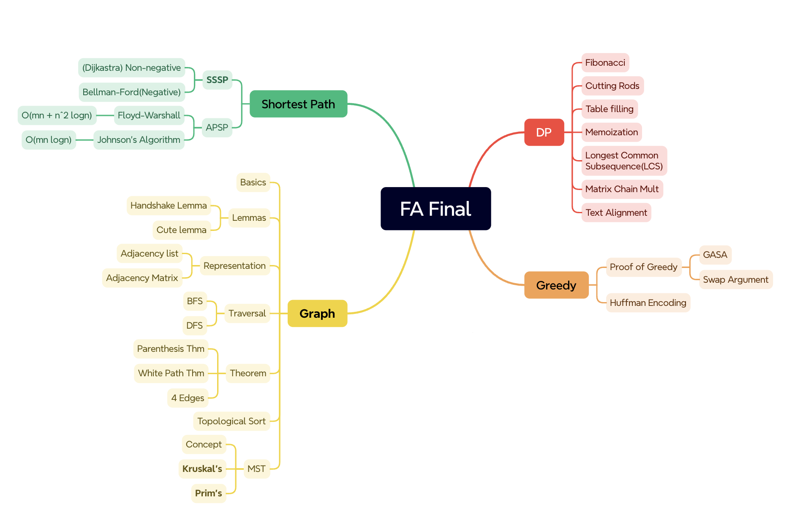
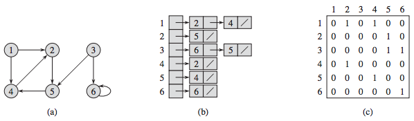
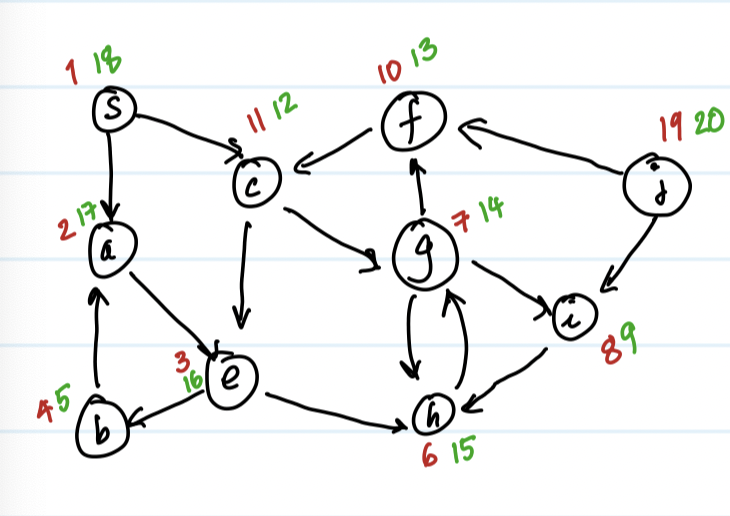

# Fundamental Algorithms
This is a repo that helps you to learn the **foundemental algorithms** as well as their **run time** analysis. The algorithms covered such as **divide and conquer**(binary search, fibonacci, etc), **sorting** algorithms(quick sort, heap sort, radix sort, etc), **BST**, **dynammic programming**, etc. 

Also to notice the material is partially based on *CSCI-GA-1170 Fundamental Algorithms* from 🎓 [NYU Courant](https://cims.nyu.edu/dynamic/). 

Enjoy your journey learning these fun algorithms! 🥳

**Table of content**
- [Fundamental Algorithms](#fundamental-algorithms)
  - [Divide and Conquer](#divide-and-conquer)
  - [Sorting](#sorting)
    - [Quicksort ⚡️](#quicksort-️)
      - [Quicksort Randomized](#quicksort-randomized)
    - [Heap sort 🌳](#heap-sort-)
    - [Counting Sort 🔢](#counting-sort-)
    - [Radix Sort 💯](#radix-sort-)
  - [Trees 🌲](#trees-)
    - [BST](#bst)
    - [2-3 Tree](#2-3-tree)
  - [4 Dynamic Programming](#4-dynamic-programming)
    - [Fibonacci sequence](#fibonacci-sequence)
    - [Cutting Rod](#cutting-rod)
    - [Longest Common Subsequence](#longest-common-subsequence)
  - [5 Greedy Algorithms](#5-greedy-algorithms)
    - [5.1 Define greedy algos](#51-define-greedy-algos)
    - [5.2 Proof of Greedy](#52-proof-of-greedy)
      - [GASA](#gasa)
      - [Swap Argument](#swap-argument)
    - [Huffman Encoding](#huffman-encoding)
  - [6 Graphs](#6-graphs)
    - [6.1 Graph Terminology](#61-graph-terminology)
    - [6.2 Graph Representations](#62-graph-representations)
    - [6.3 Graph Traversal](#63-graph-traversal)
      - [BFS](#bfs)
      - [DFS](#dfs)
      - [4 kinds of edges](#4-kinds-of-edges)
    - [6.4 Topological Sort](#64-topological-sort)
    - [6.5 Minimum Weight Spanning Tree (MST)](#65-minimum-weight-spanning-tree-mst)
    - [6.6 Kruskal's Algorithm](#66-kruskals-algorithm)
    - [6.7 Prim's Algorithm](#67-prims-algorithm)
    - [6.8 Dijsktra's Algorithm](#68-dijsktras-algorithm)
  - [7 Shortest Paths](#7-shortest-paths)
    - [7.1 Important facts](#71-important-facts)
    - [7.2 Dijkstra's Algorithm (SSSP with Non-Negative Edges)](#72-dijkstras-algorithm-sssp-with-non-negative-edges)
    - [7.3 Bellman-Ford Algorithm (SSSP with Negavtive Edges)](#73-bellman-ford-algorithm-sssp-with-negavtive-edges)
    - [7.4 Floyd-Warshall (APSP)](#74-floyd-warshall-apsp)
    - [7.5 Johnson's Algorithm](#75-johnsons-algorithm)
- [Appendix 🖇](#appendix-)
    - [PQ, Tree and heap relationship](#pq-tree-and-heap-relationship)
    - [Pivot, i, and j positioning](#pivot-i-and-j-positioning)
- [Reference 🗞](#reference-)

## Divide and Conquer
   pass

## Sorting
| Sorting        |   Time   |
| ------------   | -------- |
| Generic sort   |  O(n^2)  |
| Insertion sort |  O(n^2)  |
| Selection sort |  O(n^2)  |
| Merge sort     | Θ(nlogn) |
| Quick sort ran | Θ(nlogn) |
| Quick sort det: 1st/last element |  Θ(n^2)  |
| Quick sort det: pick median |  Θ(nlogn)  |
| Heap sort      | O(nlogn) |
| Couting sort   | O(n+k)   |
| Radix sort     | O(d(n+b))|


- `O(n^2)`: generic sort, insertion sort, quick sort deter
- `O(nlogn)`: Merge sort, Heap sort,  quick sort randomized
- `O(n)`: Radix sort, counting sort

### Quicksort ⚡️
[Questions to think through before quicksort](#pivot-i-and-j-positioning)
 **To maintain consistency, we will pick the strategy:**
  1. Move the pivot always to the beginning of the segment
  2. Initialize `i` at `low`, `j` at `low + 1`
  3. At the end swap `arr[i]` with `arr[low]`/`arr[pivot]`.
  4. If `def quick_sort_ran(arr, low, high)` choose to include `high`, then we should:
      -  use `len(arr)-1` as input
      -  input `pivot - 1` and `high`(since `len(arr)-1` used)
      -  `While j <= high`, should include `j==high`

#### Quicksort Randomized

*GIF from fullyunderstood.com*

### Heap sort 🌳
[Some questions to be cleared before heap sort 👈🏼](#pq-tree-and-heap-relationship)
**Heap sort** is a comparison-based sorting algorithm that uses a binary heap. It works by **building a heap from the input data**, then repeatedly **removing/extracting** the largest/smallest element from the heap and restoring the heap property, until the heap is empty. This process sorts the data in ascending order when a max-heap is used (or descending order if a min-heap is used).

**Heapify**
Heapify is used when removing or inserting an element into a heap, ensuring that the heap **remains a complete binary tree** and maintains its **order properties**.

**Insertion:**
**Deletion:**


### Counting Sort 🔢
[CS Dojo's YT video on counting sort](https://www.youtube.com/watch?v=OKd534EWcdk)
Counting sort is stable sorting algorithm, which keeps the original order of the element when ties occur. And counting sort works best when range of the numbers in an array is small(e.g. only 0,1,3 in the array.) 
**The steps of counting sorts are:**
1. Finding the starting index of every number, and store them in an auxiliary array.
2. Calculate the prefix sum of the array
3. Shift to the right by one element
4. Fill the new array based on the value of our auxiliary array
   - Increase the element encountered each time, and the value of auxiliary array 
   means the index of where the number should be placed.

**Runtime analysis ⏱**
T(n) = O(n+k), n is the length of the original array(total number of elements), k is the number value range in the array( [smallest, greatest] ).

Space complexity: An array of length n, and another array of length k. Thus, O(n+k).

### Radix Sort 💯
[CS Dojo's YT video on radix sort](https://www.youtube.com/watch?v=XiuSW_mEn7g)
Radix sort is sorting every numbers in the array digit-by-digit. Bsed on [counting sort](#counting-sort), radix sort is also stable.

**Runtime analysis ⏱**
Let's say:
- `n`: the length of the array 
- `d`: max digit number we need to represent all the elements
- `b`: base range where we sort in each level, such as in the base of 10, the range is [0,9]. It is also the length of the auxiliary array.

So `d` will be how many rounds of sorting we need to perform. In every round, we will carry out a counting sort in `O(n+b)`. So the overall runtime of `O(d(n+b))`, which could possibly fast than merge sort or quick sort. Choosing `b` and `d` can be a trade-off between time and space.

## Trees 🌲
### BST 
### 2-3 Tree
---


## 4 Dynamic Programming 
Dynamic programming is wonderful way of solving recurrence in a faster way in trade-off of additional space complexity either by using tabulation or memoization. 
The primary purpose of using dynamic programming (DP) is to store and reuse the results of subproblems to avoid redundant calculations, thereby reducing the overall time complexity.

### Fibonacci sequence
**Definition:** 
- fibonacci(0) = 0, fibonacci(1) = 1
- fibonacci(n) = fibonacci(n-1) + fibonacci(n-2), when n >= 2
[fibonacci.py](./4_dynammic_programming/fibonacci.py)

1. Brute force
  ```python
  def fibonacci_bf(self, n):
    if n == 0: return 0
    if n == 1: return 1
    return self.fibonacci_bf(self.n - 1) + self.fibonacci_bf(self.n - 2)
  ```
  **Runtime analysis**<br>
  Brute force has an exponetial runtime.

2. Tabulation
  ```python
  def fibonacci_table(self) -> int:
          '''Tabulation approach | Bottom-Up | Iterative'''
          n = self.n
          table = [None] * (n+1)
          table[0] = 0
          table[1] = 1
          for i in range(2, n+1):
              table[i] = table[i-1] + table[i-2]
          return table[n]
  ```
  In tabulation approach, **recursion is avoided**, the value of table[n] is achieved using a loop to get a prefix sum from 2 to n. Since it is accumulated from 2 to 3 to 4 to n, it is a bottom-up approach.

  **Runtime analysis**<br>
  DP Table filling approach has a runtime of `O(n)`.

3. Memoization
  ```python
  def fibonacci_memo(n):
    memo = {}
    memo[0] = 0
    memo[1] = 1

    if n not in memo:
      memo[n] = fibonacci_memo(n-1) + fibonacci_memo(n-2)

    return memo[n]
  ```
  **Runtime analysis**<br>
  Claim: The number of recursive calls are no greater than 2(n+1)
  Proof: At most n+1 times will be write into the memo, and every time when we write into memo, we make 2 recursive calls. So at most 2(n+1) calls.
  **Theorem: DP Memoization approach runtime: `O(n)`**


### Cutting Rod
See [cutting_rod.py](./4_dynammic_programming/cutting_rod.py)

### Longest Common Subsequence
See [longest_common_subsequence(lcs).py](./4_dynammic_programming/lcs.py)

## 5 Greedy Algorithms
### 5.1 Define greedy algos
**Activity Selection**
We are given a set of activities $(a_i, b_i)$, represented as intervals on the timeline. We want to choose collection that is disjoint, so that we can perform all these activity without them overlapping. 
What is the maximum number of activities we can choose?

**Greedy algorithm:**
1. Pick the "best first" activity.
2. Remove all activities that conflict with this
3. if exists activities remaining, keep applying this

In this case, we should always pick the intervals with the ealiest end time.

### 5.2 Proof of Greedy
#### GASA
GSAS means, at each step, a greedy algorithm makes the most optimal local choice in the hopes that these choices will lead to a globally optimal solution. (However, it's important to clarify that this doesn't mean greedy algorithms always produce the optimal solution for all problems.)

**Progress measure**
Write down a "progress measure" and show that greedy is better than any other algorithm, at all point of the algo.
**Useful tip: Clearly write down progress measure first!**

**Theorem**
- Let G be the greedy solution
- Let Z be any other solution. 
- Then for all $i \geq 0$, $F_i(G) \leq F_i(Z)$

**Prove GASA by induction**
F represents the end time of an interval here.
- Base case: $F_0(G) = F_0(Z) = -\infty$
- Inductive step: suppose $F_{i-1}(G) \leq F_{i-1}(Z)$
- Prove consider choosing about the $i_{th}$ element by G ends no greater than the $i_{th}$ element chosen by Z.

#### Swap Argument
Define a sequence of solutions: 

### Huffman Encoding
Huffman coding is a popular algorithm used for lossless data compression. It was developed by David A. Huffman in 1952 while he was a student at MIT. Huffman coding is widely used in various applications such as file compression (e.g., ZIP files), image compression (e.g., JPEG), and communication protocols.

**Using greedy algorithm to build a Huffman tree**
We want prefix free encoding(PFE), so that F(i) is ont a prefix of F(j) for any i!=j. And minimize the average depth of PFE.

**Define an Optimal Prefix Tree:**
1. No vertex with single child
2. Deeper nodes have lower probability
3. Deepest leaf(say x) has a sibling(due to prop1), which must also be a leaft(say y.)

**Theorem**
If x and y have least probability values, then there is an optimal tree where x and y are siblings.

## 6 Graphs
### 6.1 Graph Terminology
**Term:**
- `V`: Collection of vertices/node, usually `|V| = n`
- `E`: Collection of edges, usually `|E| = m`
- `e = (c, h)`: directed edge from `c` to `h`
- `e = {c, h}`: **undirected** edge between `c` and `h`
Note: Often we write undirected edges also as `(c, h)` for simplicity.

**Assume:**
- Simple graphs, so no parallel edges or self-loops.
- Edges may have weights/costs/lenghts.

**Number of edges:**
1. Undirected graph: $0 \leq m \leq \frac{n(n-1)}{2}$ (pick 2 out of n)
2. Directed graph: $0 \leq m \leq n(n-1)$, since every edge in the undirected graph can be bi-directional.

**Handshaking lemma:**
- In an undirected graph, the sum of the degrees of all vertices is equal to twice the number of edges.
- Directed graph: $$ \sum_{v \in V} indegree(v) = \sum_{v \in V} outdegree(v) = m $$
- Undirected graph: $$ \sum_{v \in V} indegree(v) = 2m $$

**Cycle Lemma:**
- Graph G = tree if any two of following 3 conditions are satisfied (and then it implies third condition):
1. G is connected
2. G has n-1 edges
3. G has no cycles

### 6.2 Graph Representations
*The following discussion in about directed graphs and trees.*

*Image from [Shichao's Notes](https://notes.shichao.io/clrs/)*

**1. Adjacency list**
- Space complexity: $Θ(m+n)$
- Lookup time: $Θ(out-deg(v))$

**2. Adjacency matrix**
- Keep in mind that every row is the source vertex, and every column is the destination vertex.
- Space complexity: $Θ(n^2)$ (indepenent of m!)
- Lookup time: $Θ(1)$

### 6.3 Graph Traversal
[BFS and DFS visualization website](https://visualgo.net/en/dfsbfs)

#### BFS
**Input:** Directed/undirected graph G = (V, E), source vertex s in V.
**Output:** For each vertex v in V, the length of the shortest path from s to v.
- `v.d`: distance from s to v(# of edges).
- `v.π`: predecessor of v in the shortest path from s to v.

**Ideas:** Find all vertices at distance t = 0,1,2,... from s, before moving to t+1.

**Question: How to check if a vertex is visited?**
**Method I: Distance:**
Set `v.d = ∞` and `v.π = NIL` for all v in V, and update `v.d` when first send. If `v.d = ∞`, then v is unvisited, otherwise not.
<details>
<summary>Pseudo code for method I</summary>
<pre><code>BFS(G, s):
  for each vertex u in G.V - {s}:
    u.d = ∞
    u.π = NIL
  s.d = 0
  s.π = NIL
  Q = ∅
  ENQUEUE(Q, s)
  while Q ≠ ∅:
    u = DEQUEUE(Q)
    for each v in G.Adj[u]:
      if v.d == ∞:
        v.d = u.d + 1
        v.π = u
        ENQUEUE(Q, v)
</code></pre>
</details><br>

**Runtime analysis:** Each node enters Q at most once, then we spend O(out-degree(node)) time to process it. Thus, the total runtime is O(n+m), think of the adjacency list representation.

#### DFS
Input: Directed/undirected graph G = (V, E). (No start node needed)
Output: For each vertex v in V, the discovery time `v.d` and finish time `v.f`, `v.π` is the predecessor of v in the DFS tree.

**Ideas:** Think of a global clock, at each time, either (1) A new node is discovered, or (2) An old node is finished.

**Question: How to check if a vertex is visited?**
**Method II: Coloring**
- the vertices: White, Gray, Black.

<details>
<summary>Pseudo code for coloring</summary>
<pre><code>
DFS-VISIT(G, u):
  time = time + 1
  u.d = time
  u.color = GRAY
  for each v in G.Adj[u]:
    if v.color == WHITE:
      v.π = u
      DFS-VISIT(G, v)
  u.color = BLACK
  time = time + 1
  u.f = time
</code>
<code>
DFS-Driver(G):
  for each vertex u in G.V:
    u.color = WHITE
    u.π = NIL
  time = 0
  for each vertex u in G.V:
    if u.color == WHITE:
      DFS-VISIT(G, u)
</code>
</pre>
</details><br>

**Runtime analysis:** The runtime is O(n+m), since we visit each node once, and spend O(out-degree(node)+1) time to process it.

**Theorem 1: Parenthesis Theorem**
1. `u.d` < `v.d` < `v.f` < `u.f` if `u` is an ancestor of `v`. | `([])` or `[()]`
2. `u.d` < `u.f` < `v.d` < `v.f` if `u` and `v` are in different subtrees of the DFS tree. `()[]` or `[]()`

**Theorem 2: White-path Theorem**
Node v is a descendent of u in T if and only if at time u.start, exists a white path from u to v.
Proof: If v is indeed a descendent of u, at time of u.start, each recursive calls on u_i are made after u.d

#### 4 kinds of edges
1. Tree edges
    Points to white nodes, to child
2. **Back edges**
    Points to grey nodes, to ancestor
3. Forward edges
    Points to black nodes, to descendent
4. cross edges
    Points to black nodes, to descendent of its sibling's subtree

**Theorem: Cycle and back edges**
**G has no cycles(acyclic) <=> DFS(G) has no back edges**

### 6.4 Topological Sort
**Definition:** A topological sort of a directed acyclic graph (DAG) is a linear ordering of its vertices such that for every directed edge `u -> v`, `u` comes before `v` in the ordering.
Input: Directed Acyclic Graph G = (V,E)
Output: Nodes in an order that all edges go from left to right.

**How to run topo sort on a DAG?**
1. Run DFS
2. Output in reverse order of v.f numbers.

### 6.5 Minimum Weight Spanning Tree (MST)
Input: Connected, undirected graph G = (V, E) with edge weights.
Output: A subset of edges E' ⊆ E such that G' = (V, E') is a tree and the sum of the weights of the edges in E' is minimized.

### 6.6 Kruskal's Algorithm
<br>
*Demo from Wikipedia*<br>
Repeatedly pick the cheapest edge until the graph is connected.
**Steps:**
- Sort edges to that `w(e1) <= w(e2) <= ... <= w(em)`
- Create an empty Set `S`
- for i=1 to m:
  - if adding `e_i` to S created no cycles:
  - add `e_i` to S
- return T = (V, S)
<pre><code>
def kruskals(G, W):
    sorted_w = sorted(W) # O(nlogn)
    S = {}

    for w in sorted_w: # Θ(n)
        if w not in S and S.append(w, inplace=False).acyclic():
            if S.size() > G.V - 1: 
                break
            S.append(w)
    return T(V,S)
</code></pre>
How to prove the correctness and fastness of Kruskal's algorithm?
- GASA
- Swap Argument

**Union Find**
- `Find-Set(x)`: return the representative of the set containing x.
- `Union(x, y)`: merge the sets containing x and y.
- `Make-Set(x)`: create a new set with a single element x.
- `Union by rank`: merge the smaller tree into the larger tree.
- `Path compression`: make the path from x to the root shorter.
  

**Runtime analysis:** O(mlogm + mlogn), where m is the number of edges, n is the number of vertices.

### 6.7 Prim's Algorithm
<br>
*The image's from [stackoverflow](https://stackoverflow.com/questions/1195872/when-should-i-use-kruskal-as-opposed-to-prim-and-vice-versa).*
<summary>Prim's Algorithm</summary>
<pre><code>Prims(G,s):
  S = {s}
  n = |G.V|
  for i=1 to n-1:
    find an edge `e` of minimum weight connecting s to a vertex in V-S
    add e to S
  return S
</code></pre>
<br>

### 6.8 Dijsktra's Algorithm
Prim's and Kruskal's algorithms are used to connect all vertices in a graph in the cheapest way possible. Dijkstra's algorithm is used to find the cheapest route between two vertices.

## 7 Shortest Paths
Two scenarios we will discuss:
1. SSSP: Single source shortest path
2. ASSP: All source shortest path

| Type | Algorithm     | Runtime            |
|------|---------------|--------------------|
| SSSP | Dijkstra      | $O((m+n)logn)$     |
|      | Bellman-Ford  | $O(mn)$            |
| APSP | Floyd-Warshall| $O(mn + n^2logn)$  |
|      | Johnson's     | $O(mnlogn)$        |

**Shortest path metrics**
Define shortest path as:
$$ \delta(u,v) = min_{P:u->v} \omega(P)$$
δ(u,v) = +∞ if no path from u to v(Unreachable, infinite distance). This is the thing we try to compute! s.d can hold estimates.

### 7.1 Important facts
**Fact 1: Optimal substructure**
If P is the shortest path from 1 to k, then any sub paths (i,j)will be the shortest path connecting i and j.

**Fact 2: Triangle Inequality**
$$\delta(u,v) \leq \delta(u,x) + \delta(x,v)$$
Inequality holds true if and only if x is on a shortest u->v path.

**Fact 3: Negative cycle**
If weight are negative, then there may not be a well-defined shortest path. This is because of a negative weight cycle can go around forever.

### 7.2 Dijkstra's Algorithm (SSSP with Non-Negative Edges)
See [Dijkstra.py](./6_graphs/dijkstra.py)

**Relaxing**
- Maintain estimates for shortest path distance to each node: v.d
  - initially: s.d = 0, v.d = ∞ 
  - Take node u with the smallest estimates that is not output yet
    - look at its outgoing edges and update estimates
    - output u (u.d == δ(s,u))

<pre><code>Dijkstra(G, s):
    Set = {}
    s.d = 0, v.d = ∞ forall v != s
    s.π = nil, v.π = nil
    while |Set| < |V|
      u <- extractmin(V\Set) # Using PQ
      Set.add(u)
      for v in Adj[u]:
        v.d <- min(r.d, u.d+w(u,v))
        v.π <- u
</code></pre>

**Lemma1:** $v.d \geq \sigma(s,v)$ at all times
**Lemma2:** The order that each node added to the set is the same oder that there distance is in.
**Lemma3:** At the time when u added to S, $u.d =\sigma(s,u)$

### 7.3 Bellman-Ford Algorithm (SSSP with Negavtive Edges)
**Bellman-Ford algorithm features:**
1. Deal with negative weights
2. Detect negative weight cycle
3. Incorporate Dynamic Programming in relaxing
4. Has a runtime of O(mn)

**Pseucode code:**
<pre><code>Bellman-Ford(G, s)
  for each vertex v in G:
    v.d = ∞
  s.d = 0

  for i from 1 to |V| - 1:
    for each edge (u, v) in G:
      if u.d + w(u, v) < v.d:
        v.d = u.d + w(u, v)

  for each edge (u, v) in G:
    if u.d + w(u, v) < v.d:
      error("Graph contains a negative-weight cycle")

  return
</code></pre>
See [bellman_ford.py](./6_graphs/bellman_ford.py)

**Recursion and DP**
Bellman-Ford keeps a table to store the shortest distance array `DP = []`, and update it based on the neighbors.
In relaxation:
$$DP[v] = min(DP[v], DP[u] + w(u,v))$$
is a bottom-up fill taling DP inplementation.

Now, let's prove the recursive relation.
Define: $T_{s->v}^k$ = shortest path from s to v using **at most** k edges.
Base case: $T_{s->s}^k = 0$, $T_{s->v}^k = \infin$
Recurrence:
$$T_{s \rightarrow v}^k = min_{x \in V}(T_{s \rightarrow x}^{k-1} + w(x,v))$$
(* We include `v` itself in x as well)
- O(m): Compute $T^k$ from T^{k-1}
- n-1: $T^{n-1}$ - each SP has at most n-1 vertices
- Runtime = O(mn)

Implementation:
$$T[v] = min(T[v], T[u] + u(u,v))$$
Where T store the shortest distance, so T[v] will based on T[u] and the weight, T[u] will based on its in-edges, recursively fill the table.

### 7.4 Floyd-Warshall (APSP)
- Run Bellman n times: $n * O(mn) = O(mn^2) = O(n^4)$
- Floyd-Warshall can run in $O(n^3)$, or $O(mn+n^2logn)$ for sparse graphs(where m much smaller than $n^2$).

Define: $F_{u \rightarrow v}^k$ is the shortest path from u to v using paths containing intermediate vertices from {1,2,..**z**} (First z vertices).

**Base case:**
F is a 2D array of size (1+m)(1+n)
$F_{u \rightarrow u}^k = 0$
$F_{u \rightarrow v}^k = w(u,v)$
$F_{u \rightarrow v}^k = \infin$, otherwise

**Recursion**
$$F_{u \rightarrow v}^{k} = min_{x \in u \rightarrow v}(F_{u \rightarrow v}^{k-1}, F_{u \rightarrow x}^{k-1} + F_{x \rightarrow v}^{k-1})$$

**DP implementation**
<pre><code>
  Floyd-Warshall(G)
  n = number of vertices in G

  T = array of size [n][n]
  for i from 1 to n:
    for j from 1 to n:
      if i == j:
        T[i][j] = 0
      else if there is an edge from i to j:
        T[i][j] = w(i, j)
      else:
        T[i][j] = ∞

  for k from 1 to n:
    for i from 1 to n:
      for j from 1 to n:
        T[i][j] = min(T[i][j], T[i][k] + T[k][j])
  return T
</pre><code>
see [floyd_warshall.py](./6_graphs/floyd_warshall.py)

### 7.5 Johnson's Algorithm
Ideas in short: Shift all the edges to non-negative, then run n times Dijkstra's to every pair. We get $O(mnlogn)$.

**Johnson's Algo**
1. Use 1 run of Bellman to get "shifts". $O(mn)$
2. "shift" all the edges to non-negative. $O(m)$
    (shortest path stays the same)
3. Run n times Dijkstra's. $O(mnlogn)$
**Overall runtime:** $O(mnlogn)$

**Shifting**
1. We have a height function: $h(V) -> \real$.
2. We define $$\hat{w_{u,v}} = h(u) - h(v) + w(u,v)$$

**Why the shortest path stay the same?**
$$\hat{w_{s,t}} = \hat{w_{v1,v2}} + \hat{w_{v2,v3}} + ... + \hat{w_{v_{n},v}} = h(s) - h(v) + w(s,t)$$

**How to shift?**
Or how to make $\hat{w(u,v)} \geq 0$ for all $u,v \in V$?
- Find a $V^*$ so that it can reach every other node, compute every node's distance from $V^*$, define the distance as height, and it must be non-negative.

# Appendix 🖇
### PQ, Tree and heap relationship
We need to distinguish between `priority queue`, `heap`, `binary tree` and `array` before discussing the implementation of heap sort, because these concepts always intertwined and confused me while learning this sorting algorithm.
- `Priority queue`: A priority queue is an **abstract data type**(not a data structure) that operates similarly to a regular queue or stack but with a **"priority"** feature. A priority queue can be implemented using **various** data structures, including heaps (most commonly), binary trees, or even arrays.
- `Heap`: Heap is a **specialized** tree-based data structure where each node conform to the same rules(like max heap or min heap.) A Binray heap can also be implemented as an array for efficiency.
- `Binary tree`: A tree data structure in which each node has at most two children. It's a **fundamental** structure that can be specialized into more **specific types**, such as BST, AVL trees, and heaps.
- `Array`: Arrays can be used to implement binary heaps efficiently due to the **predictable structure of a complete binary tree**, where the relationships between parent and child nodes can be calculated using the indices.

**In conclusion**, a binary heap is a more specific type of binary tree, tailored for efficiently managing hierarchical data according to certain rules (heap property).
A priority queue is an abstract concept that specifies behavior (an ADT) rather than a concrete data structure. A binary heap is a specific data structure that efficiently implements the priority queue ADT.

### Pivot, i, and j positioning
1. Why do we need to put `arr[pivot]` somewhere "safe"? And where should we put it? First or last position?
2. Where should we initialize `i` and `j`?
3. In the last step of swapping `arr[pivot]` to the middle, which element should we switch with?
4. Where on earth does `arr[i]` point to?
   - The last element in "smaller" section? Or the first element in "greater" section? Or the first one of "uncompared" section?....
   - `i` points to the last index where an element is less than or equal to the pivot.
5. **"Two pointers"** algorithm in quick sort.
   - Quicksort also implemented **"Two pointers"** algorithm, where i is the slow pointer, and j is the fast pointer. `i` only moves if `arr[j]` is greater than `arr[pivot]`, and increments after swapping.

# Reference 🗞
1. [Visualgo](https://visualgo.net/en/sorting)
2. [Sort visualizer](https://sortvisualizer.com/)
3. [A greate article on QSR](https://www.baeldung.com/cs/randomized-quicksort)

[👆🏻 Go back to top 👆🏻](#fundamental-algorithms)